# **OpenSCAD**

Ein OpenSCAD Basis Tutorial von Peter Recktenwald 

https://www.berlincreators.de

---

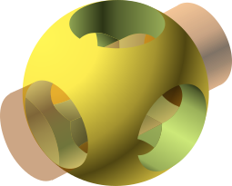

# Was ist OpenSCAD?

OpenSCAD ist eine freie Software um 3D CAD Objekte zu designen. Im Gegensatz zu vielen anderen CAD Programmen werden in OpenSCAD die 3D Objekte mit einer textbasierten Skriptsprache erstellt.
Die Objekte bestehen aus einfachen Grundkörpern die zu komplexen 3D Modellen kombiniert werden. 

---

# Was wird benötigt?

* OpenSCAD http://openscad.org/downloads.html
* Basis Tutorial https://github.com/robotfreak/badge-creator
* FontAwesome brand und free Font https://github.com/FortAwesome/Font-Awesome
* Baumans Font https://www.1001fonts.com/baumans-font.html

---

# Installation

OpenSCAD läuft auf Linux, Mac und Windows Platformen (auch auf dem Raspberry Pi, siehe https://github.com/koendv/openscad-raspberrypi/releases). 

Das Basis Tutorial kann als Zip Datei heruntergeladen werden und in einem beliebigen Ordner ausgepackt werden. 

Die Fonts werden je nach OS entsprechend installiert und stehen dann unter OpenSCAD zur Verfügung.

---

# Los geht's mit dem Customizer 

Anfangen wollen wir mit dem Customizer. Da sich OpenSCAD Modelle sehr gut parametrisieren lassen ist dies ein einfacher Einstieg, der ohne Programmierkenntnisse auskommt.

Dazu öffnen wir OpenSCAD  und laden das Skript badge-creator.scad aus dem Basis Tutorial Ordner.

Den Editor links im Bild schliessen wir zunächst (klick auf das x). Statt dessen benötigen wir den Customizer (Im Menü 'Windows' den Haken vor 'Hide customizer' entfernen).

---

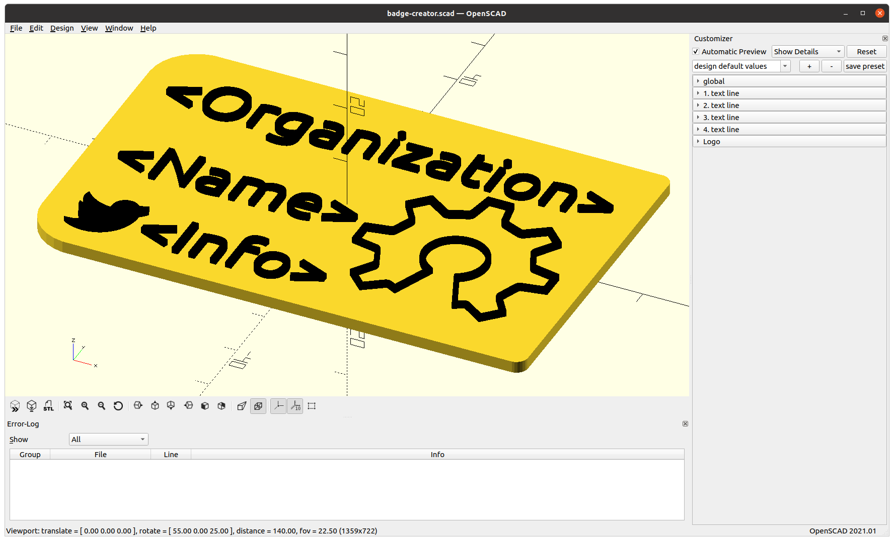

---

# Navigation in der Vorschau

Die Vorschau des Modells kann mit dem Scrollrad der Maus vergrößert/verkleinert werden.

Bei gedrückter linker Maustaste lässt sich das Modell in den Raumachsen bewegen.

Bei gedrückter rechter Maustaste lässt sich die Kameraposition, der Blick auf das Modell, ändern.

Zudem gibt es eine Iconleiste unter dem Vorschau Fenster, um die Ansicht zu ändern. 

---

# Der Customizer

Über den Customizer lassen sich Parameter des Modells ändern, sofern der Schöpfer des Modells dies vorgesehen hat. 

In unserem Beispiel, dem badge-creator können die globalen Parameter u.a Form, Breite und Höhe des Badge, sowie der Text, Position, Font und Fontgröße für maximal 4 Textzeilen geändert werden. Zudem kann ein beliebiges SVG Logo oder ein QR Code platziert werden.

Damit lassen sich Badges für viele Anwendungszwecke individuell anpassen, ohne auch nur einzige Zeile zu programmieren.   

---

# globale Einstellungen

Zu den globalen Einstellungen zählen:
* die Form des Badge (rund, eckig oder ein SVG Bild),
* Die Abmessungen, 
* die Rundung der Ecken (bei der eckigen Form),
* Um welche Höhe der Text erhoben ist,
* Ob der Text in die Höhe ragt oder nach unten (Gravur), 
* ein Loch für Schlüsselanhänger 
* oder Vertiefungen für Magnete (zum Einkleben)

---

# Text Einstellungen

Jede der 4 Textzeile kann:
* der anzuzeigende Text,
* der verwendete Font,
* die Fontgröße,
* die Position auf dem Badge,

Als Sonderfall können auch Icons dargestellt werden, z.B aus dem FontAwesome Brand oder Free Font. 

---

# Logo Einstellungen

Das Logo kann ebenso frei positioniert und in der Größe skaliert werden. Das SVG File muss im selben Ordner liegen wie das Skript.

ALs Logo kann auch ein QR Code eingebunden werden. Dieser kann online unter https://ridercz.github.io/OpenSCAD-QR/ erzeugt werden. Die Daten unter qr_data werden dann per copy & paste an die entsprechende Stelle in der Datei qrcode.scad eingefügt. 

---

# 1. Übung

Als erste Übung könnt ihr ein persönliches Badge erstellen, z.B. ein Namens-Schild, einen Schlüsselanhänger oder einen Chip für Einkaufswagen.

 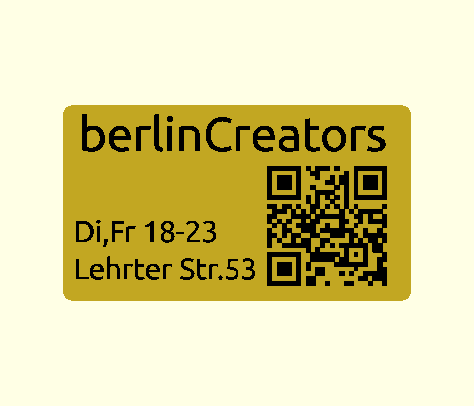 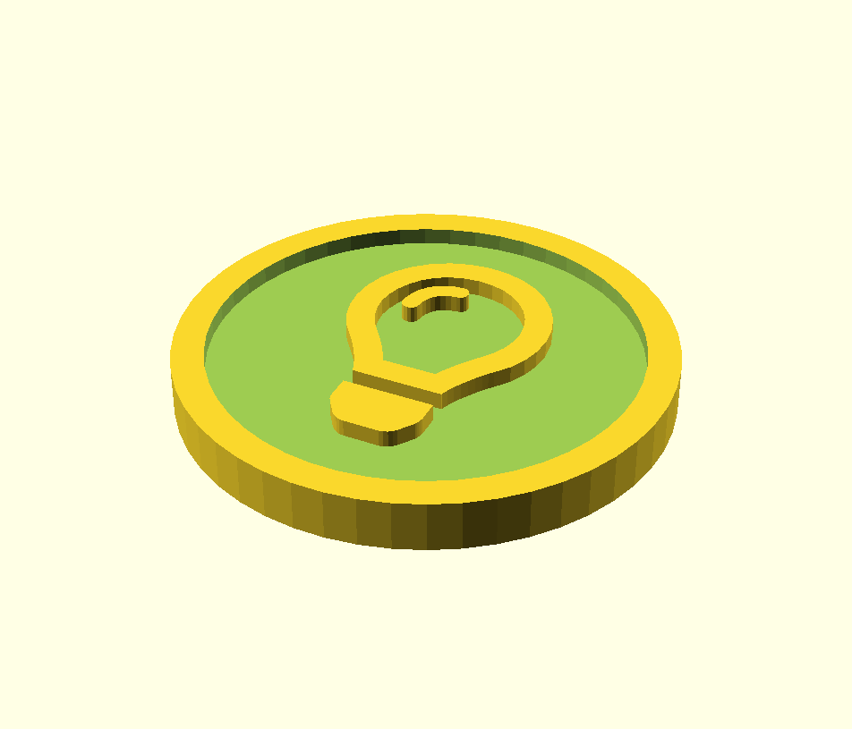

---

# OpenSCAD Programmierung

Kommen wir zum eigentlichen Thema die Programmierung von SCAD. Die Befehlsübersicht findet man unter dem Menüpunkt 'Help | Cheat Sheet'. Dahinter verbirgt sich ein Link auf: https://openscad.org/cheatsheet/

---

# 3D Grundkörper

Anfangen wollen wir mit den 3D Grundkörper. Davon gibt es nur ein paar wenige:
* Würfel (cube)
* Zylinder (cylinder)
* Kugel (sphere)
* Polyeder (polyhedron)

---

# Würfel, Quader

Syntax: cube(l); cube(l, center=true); cube([x,y,z]);

Der Befehl cube zeichnet einen Würfel mit der Kantenlänge als Parameter. Einen Quader zeichnet man durch Angabe der x,y,z Kantenlänge in eckigen Klammern. Der optionale Parameter center=true zentriert den Würfel 

---

# Beispiele cube

Die folgenden Beispiele zeichnen einen Würfel mit 10mm Kantenläge, einen zentrierten Würfel mit 10mm Kantenläge und einen Quader mit 30x20x10mm (x,y,z) Kantenlänge.

cube(10); cube(10, center=true); cube([30,20,10]);

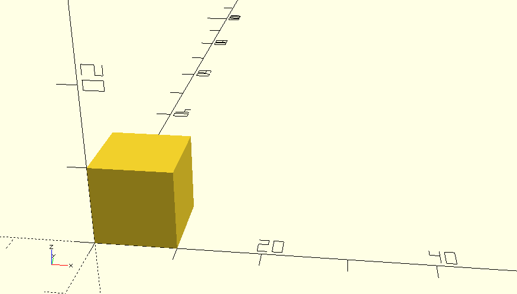 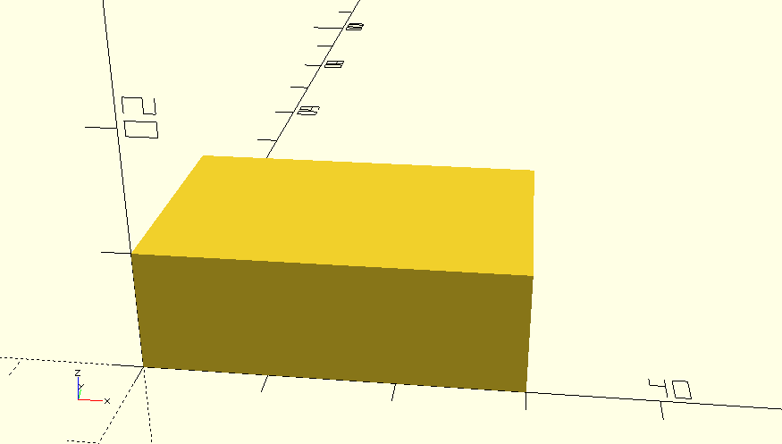 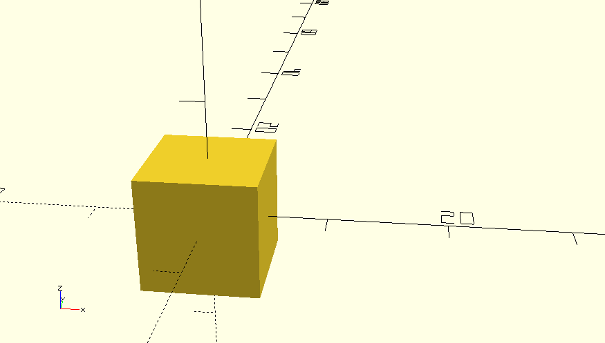

---

# Zylinder, Kegel

Syntax: cylinder(r,h)

Der Befehl cylinder zeichnet einen Zylinder. Als Parameter kann der Radius r oder der Durchmesser und die Höhe h angegeben werden. Für einen Kegel gibt man r1 für den unteren Radius und r2 für den oberen Radius, bzw  d1 und d2 für den Durchmesser an.

---

# Beispiele cylinder

Die folgenden Beispiele zeichen einen Zylinder, einen spitzen und einen stumpfen Kegel. 
cylinder(h=30, r=10); 
cylinder(h=30, r1=10, r2=0, center=0); cylinder(h=30, r1=10, r2=5, center=0);

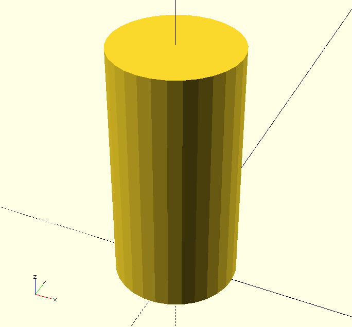 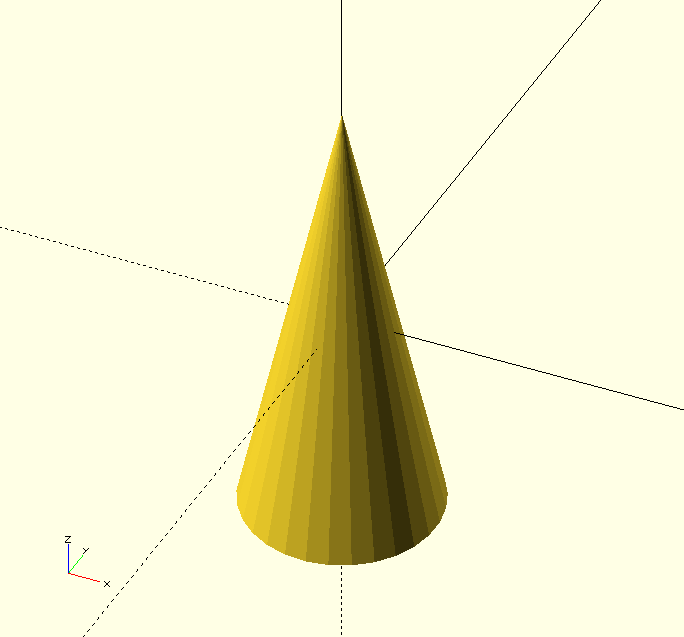 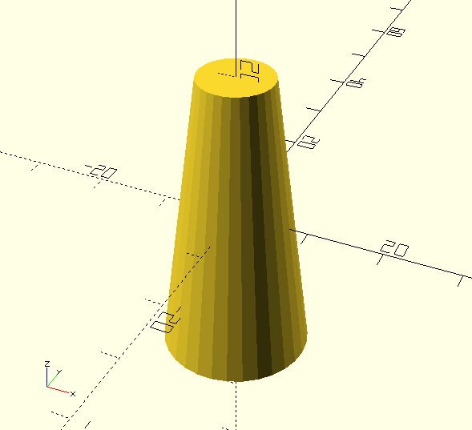 

---

# Kugel

Der Befehl sphere zeichnet eine Kugel. Als Parameter gibt man den Radius r oder den Durchmesser d an. 
Die Anzahl der Ecken kann über den Parameter $fn bestimmt werden. Je höher desto feiner aufgelöst wird die dargestellte Kugel 

---

# Beispiele Kugel 

Die folgenden Beispiele zeichen Kugeln mit 8, 30 und 100 Ecken.

sphere(10, $fn=8); sphere(10); sphere(10, $fn=100); 

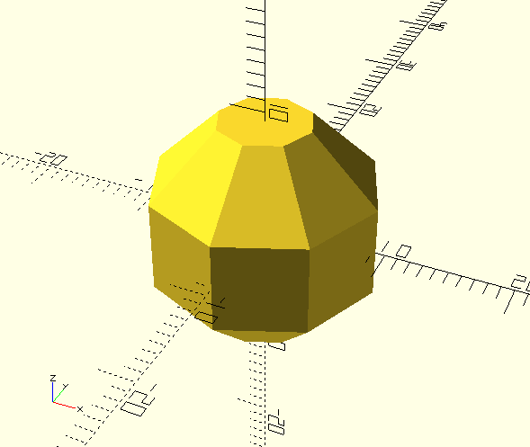 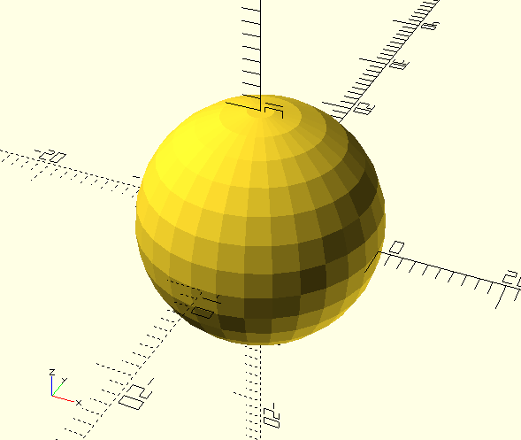 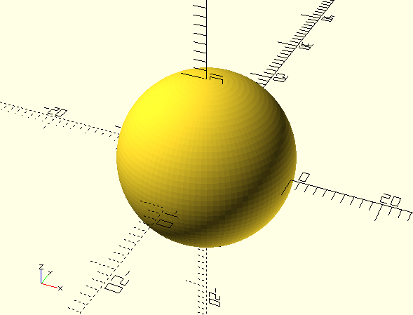

---

# Bewegen von Objekten

Zum Bewegen eines 3D Objektes im 3 dimensionalen Raum gibt es die beiden Befehle:
* translate - zum Positionieren des Objekts in x,y, und z-Richtung
* rotate - zum Drehen eines Objektes um die x, y, oder z-Achse. 

Die Parameter für x, y und z werden jeweils in eckigen Klammern mit Komma getrennt angegeben.

---

# Verschieben - translate

Syntax: translate([x,y,z]) object();
 
Translate bewegt ein Objekt in x-, y- bzw. z-Richtung.

---

# Beispiel translate

Der folgende Befehl verschiebt einen Würfel um 10mm in x-Richtung, 0mm in y-Richtung und 5mm in z-Richtung.

translate([10,0,5]) cube(10);

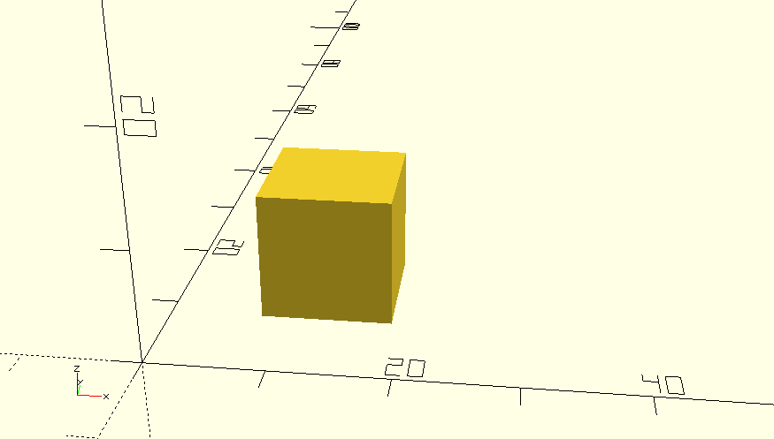

---

# Rotate 

Syntax rotate([x,y,z]) object();

Rotate rotiert ein Objekt um die  x-, y- bzw. z-Achse.

---

# Beispiel rotate

Der folgende Befehle rotiert einen Würfel um 45° um die x-Achse. 

rotate([45,0,0]) cube(10, true);

Beachte hier, dass der Würfel zentriert ist (center=true). Dann liegt die Rotations-Achse im Mittelpunkt des Würfels.

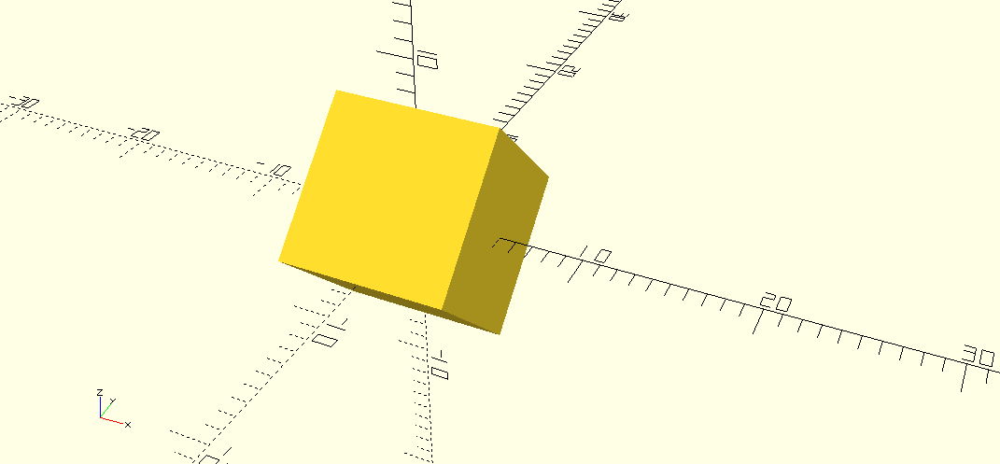

---

# 2. Übung

Mit den bisher vorgestellten Befehlen lässt sich bereits einges anfangen. Als Übung soll eine aus Grundkörpern zusammengesetze Gebäude erstellt werden, z.B. ein Haus, ein Turm, oder eine Brücke. Benutze translate und rotate um die Grundkörper im Raum anzuordnen bzw. zu drehen.

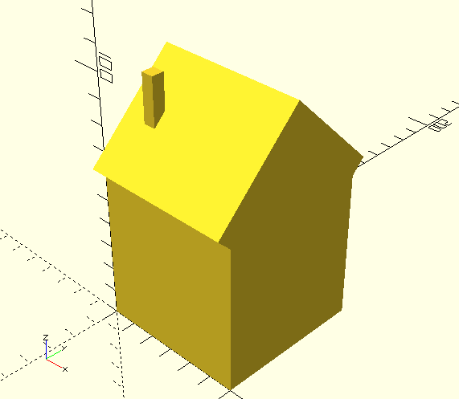 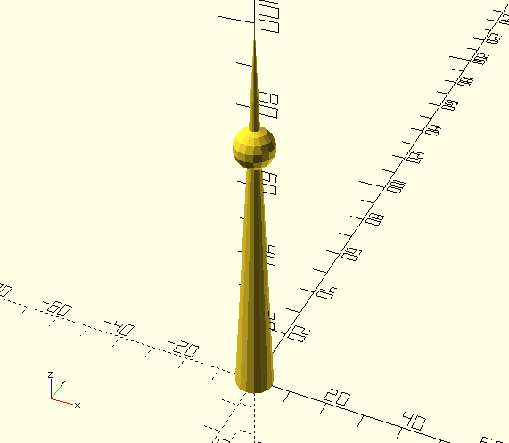 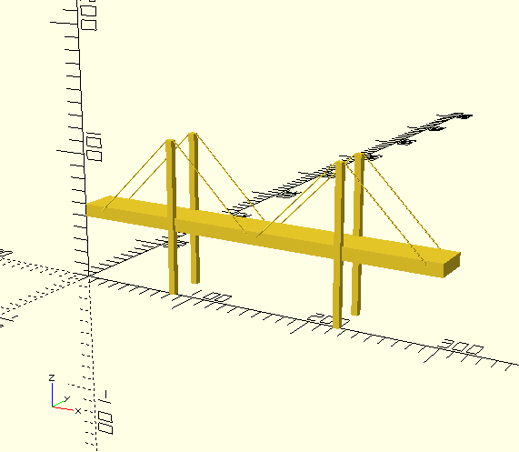

---

# Mengenoperationen

Zu den Mengenoperationen (boolsche Operationen) in OpenSCAD zählen:

* Zusammenfassen - union
* Differenz - difference
* Schnittmenge - intersection

---

# Zusammenfassen - union

Syntax: union() { object1(); object2(); }

Der Befehl union fasst mehrere Objekte zu einem Objekt zusammen. Auf das zusammengefasste Objekt können dann andere OPerationen wie verschieben (translate), rotieren (rotate) etc. angewandt werden.

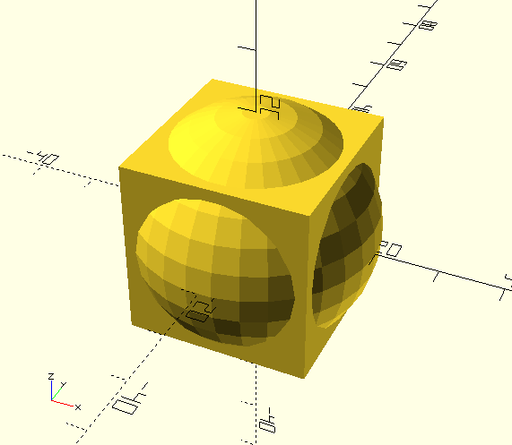

---

# Differenz - difference

Syntax: difference() { object1(); object2(); }

Der Befehl difference zieht vom ersten angegebenen Objekt die folgenden Objekte ab.

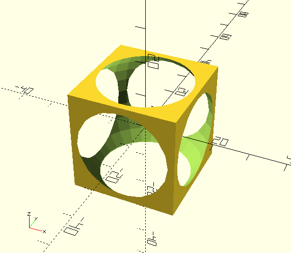 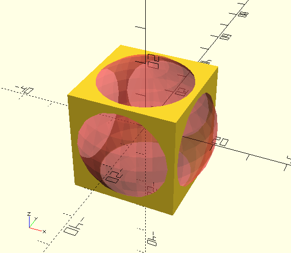

---

# Schnittmenge - intersection

Syntax: intersection() { object1(); object2(); }

Der Befehl intersection bildet die Schnittmenge von Objekten.

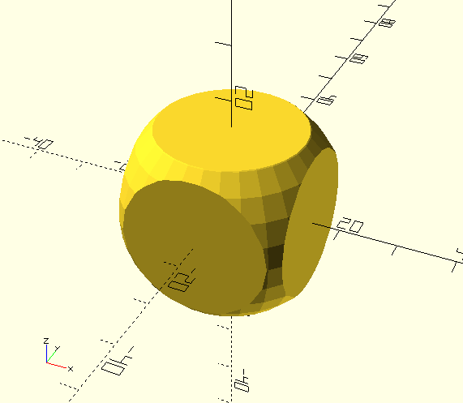 
