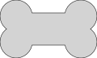
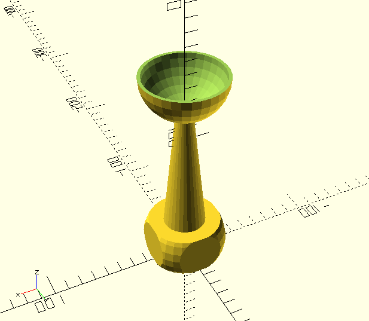
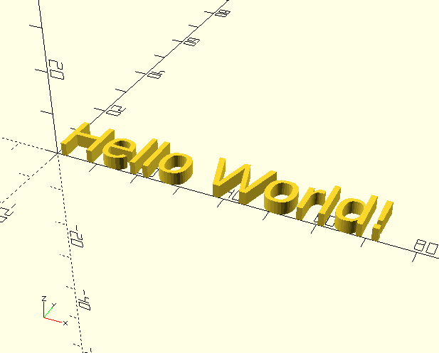
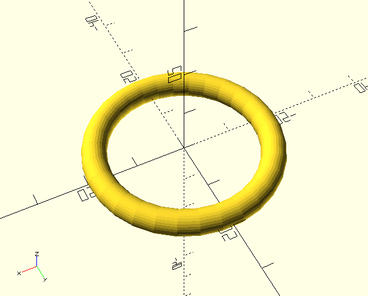
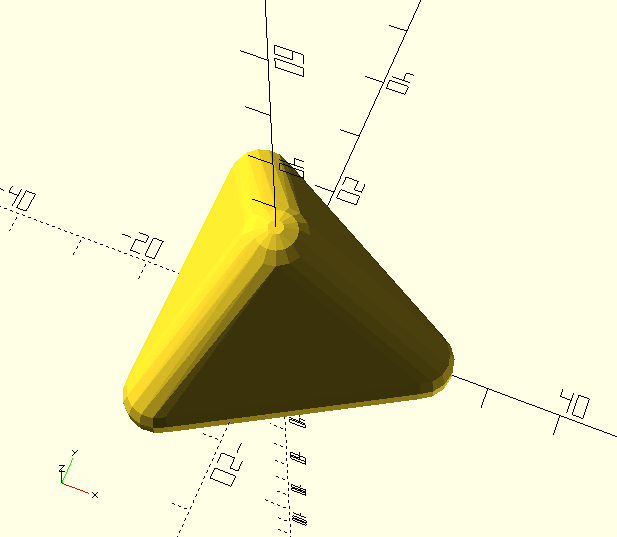
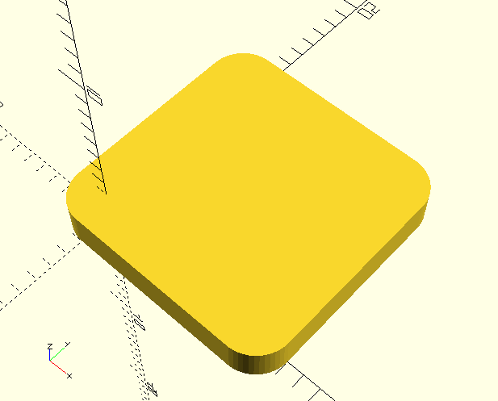

# **OpenSCAD**

Ein Basis Workshop mit OpenSCAD, dem etwas anderen 3D Design Tool

von Peter Recktenwald 

https://www.berlincreators.de

---

# Was ist OpenSCAD?

OpenSCAD ist eine freie Software um 3D CAD Objekte zu designen. Im Gegensatz zu vielen anderen CAD Programmen werden in OpenSCAD die 3D Objekte mit einer textbasierten Skriptsprache erstellt.
Die Objekte bestehen aus einfachen Grundkörpern die zu komplexen 3D Modellen kombiniert werden. 

---

# Was wird benötigt?

* OpenSCAD http://openscad.org/downloads.html
* Basis Tutorial https://github.com/robotfreak/badge-creator
* FontAwesome brand und free Font https://github.com/FortAwesome/Font-Awesome
* Baumans Font https://www.1001fonts.com/baumans-font.html
* American Stencil Font https://www.1001fonts.com/american-stencil-font.html

---

# Installation

OpenSCAD läuft auf Linux, Mac und Windows Platformen (auch auf dem Raspberry Pi, siehe https://github.com/koendv/openscad-raspberrypi/releases). 

Das Basis Tutorial kann als Zip Datei heruntergeladen werden und in einem beliebigen Ordner ausgepackt werden. 

Die Fonts werden je nach OS entsprechend installiert und stehen dann unter OpenSCAD zur Verfügung.

---

# Schnellstart mit dem Customizer 

Anfangen wollen wir mit dem Customizer. Da sich OpenSCAD Modelle sehr gut parametrisieren lassen ist dies ein einfacher Einstieg, der ohne Programmierkenntnisse auskommt.

Dazu öffnen wir OpenSCAD  und laden das Skript **badge-creator.scad** aus dem Basis Tutorial Ordner.

Den Editor links im Bild schliessen wir zunächst (klick auf das x). Statt dessen benötigen wir den Customizer (Im Menü 'Windows' den Haken vor 'Hide customizer' entfernen).

---

---

# Navigation in der Vorschau

Die Vorschau des Modells kann mit dem Scrollrad der Maus vergrößert/verkleinert werden.

Bei gedrückter linker Maustaste lässt sich das Modell in den Raumachsen bewegen.

Bei gedrückter rechter Maustaste lässt sich die Kameraposition, der Blick auf das Modell, ändern.

Zudem gibt es eine Iconleiste unter dem Vorschau Fenster, um die Ansicht zu ändern. 

---

# Tastaturbefehle

Die wichtigsten Tastaturbefehle in OpenSCAD sind:

* F4 Modell neu laden und Vorschau aktualisieren
* F5 Vorschau aktualisieren
* F6 Modell rendern
* F7 Modell als STL speichern

---

# Der Customizer

Über den Customizer lassen sich Parameter des Modells ändern, sofern der Schöpfer des Modells dies vorgesehen hat. 

In unserem Beispiel, dem badge-creator können die globalen Parameter u.a Form, Breite und Höhe des Badge. Der Text, Position, Font und Fontgröße kann für maximal 5 Textzeilen geändert werden. Zudem kann ein beliebiges SVG Logo oder ein QR Code platziert werden.

Damit lassen sich Badges für viele Anwendungszwecke individuell anpassen, ohne auch nur einzige Zeile zu programmieren.   

---

# globale Einstellungen

Zu den globalen Einstellungen zählen:
* die Form des Badge (rund, eckig oder ein SVG Bild),
* Die Abmessungen, 
* die Rundung der Ecken (bei der eckigen Form),
* Die Höhe des Textes,
* Ob der Text in die Höhe ragt oder nach unten (Gravur), 
* ein Loch für Schlüsselanhänger 
* oder Vertiefungen für Magnete (zum Einkleben)

---

# Text Einstellungen

Für jede der 5 Textzeilen kann:
* der anzuzeigende Text,
* der verwendete Font,
* die Fontgröße,
* die Position des Textes auf dem Badge,
* die Text Rotation

eingestellt werden.

---

# Icons als Text

Auch Icons aus Icon Fonts können als Text verwendet und dargestellt werden. Der entsprechende Font muss dazu auf dem Rechner installiert werden. Sehr beliebt ist z.B. der Fontawesome Font (https://fontawesome.com/). 
Zum Einfügen der Icons ist das Cheat Sheet hilfreich (https://fontawesome.com/v5/cheatsheet/free/solid). Einfach das gewünschte Icon auswählen und per copy & paste einfügen. 

---

# Logo Einstellungen

 Als Logo können SVG Files oder Orcodes eingebunden werden. Das Logo kann ebenso frei positioniert, in der Größe skaliert und rotiert werden. 

---

# SVG als Logo

Ein SVG File als Logo sollte möglichst einfach gestaltet sein. Inkscape oder OpenSCAD können zum Erzeugen von SVG Dateien verwendet werden
Das SVG File muss im selben Ordner liegen wie das Skript.
Vorlagen zu frei verwendbaren SVG Files findet man z.B. unter:

* https://freesvg.org/

---

# Qrcode als Logo

 Als Logo kann auch ein QR Code eingebunden werden. Leider klappt das nicht mit SVG Files. Der Qrcode kann online unter https://ridercz.github.io/OpenSCAD-QR/ erzeugt werden. Die Daten unter qr_data werden dann per copy & paste an die entsprechende Stelle in der Datei **qrcode.scad** eingefügt. 

---

# 1. Übung

Erzeuge aus dem Beispiel **badge-creator.scad**  ein persönliches Badge, z.B. ein Namensschild, einen Schlüsselanhänger oder einen Chip für Einkaufswagen.

  

---

# OpenSCAD Programmierung

Kommen wir zum eigentlichen Thema die Programmierung von SCAD. Die Befehlsübersicht von OpenSCAD findet man unter dem Menüpunkt 'Help | Cheat Sheet'. 

Dahinter verbirgt sich ein Link auf: 
https://openscad.org/cheatsheet/

---

# 3D Grundkörper

Anfangen wollen wir mit den 3D Grundkörpern:
* Würfel (cube)
* Zylinder (cylinder)
* Kugel (sphere)
* Polyeder (polyhedron)*

*Der Polyeder ist eher etwas für fortgeschrittene User.

---

# Würfel, Quader

Syntax: cube(l); cube(l, center=true); cube([x,y,z]);

Der Befehl **cube** zeichnet einen Würfel mit der Kantenlänge als Parameter. Einen Quader zeichnet man durch Angabe der x,y,z Kantenlänge in eckigen Klammern. Der optionale Parameter center=true zentriert den Würfel 

---

# Beispiele: Würfel

Die folgenden Beispiele zeichnen einen Würfel mit 10mm Kantenläge, einen zentrierten Würfel mit 10mm Kantenläge und einen Quader mit 30x20x10mm (x,y,z) Kantenlänge.

cube(10); cube(10, center=true); cube([30,20,10]);

  

---

# Zylinder, Kegel

Syntax: cylinder(r,h)

Der Befehl **cylinder** zeichnet einen Zylinder. Als Parameter kann der Radius r oder der Durchmesser und die Höhe h angegeben werden. Für einen Kegel gibt man r1 für den unteren Radius und r2 für den oberen Radius, bzw  d1 und d2 für den Durchmesser an.

---

# Beispiele: Zylinder

Die folgenden Beispiele zeichen einen Zylinder, einen spitzen und einen stumpfen Kegel. 
cylinder(h=30, r=10); 
cylinder(h=30, r1=10, r2=0, center=0); cylinder(h=30, r1=10, r2=5, center=0);

   

---

# Kugel

Der Befehl **sphere** zeichnet eine Kugel. Als Parameter gibt man den Radius r oder den Durchmesser d an. 
Die Anzahl der Ecken kann über den Parameter $fn bestimmt werden. Je höher desto feiner aufgelöst wird die dargestellte Kugel 

---

# Beispiele: Kugel 

Die folgenden Beispiele zeichen Kugeln mit 8, 30 und 100 Ecken.

sphere(10, $fn=8); sphere(10); sphere(10, $fn=100); 

  

---

# Bewegen von Objekten

Zum Bewegen eines 3D Objektes im 3 dimensionalen Raum gibt es die beiden Befehle:
* translate - zum Positionieren des Objekts in x,y, und z-Richtung
* rotate - zum Drehen eines Objektes um die x, y, oder z-Achse. 

Die Parameter für x, y und z werden jeweils in eckigen Klammern mit Komma getrennt angegeben.

---

# Verschieben - translate

Syntax: translate([x,y,z]) object();
 
Der Befehl **translate** bewegt ein Objekt in x-, y- bzw. z-Richtung.

---

# Beispiel translate

Der folgende Befehl verschiebt einen Würfel um 10mm in x-Richtung, 0mm in y-Richtung und 5mm in z-Richtung.

translate([10,0,5]) cube(10);

---

# Rotate 

Syntax rotate([x,y,z]) object();

Der Befehl **rotate** rotiert ein Objekt um die  x-, y- bzw. z-Achse.

---

# Beispiel rotate

Der folgende Befehle rotiert einen Würfel um 45° um die x-Achse. 

rotate([45,0,0]) cube(10, true);

Beachte hier, dass der Würfel zentriert ist (center=true). Dann liegt die Rotations-Achse im Mittelpunkt des Würfels.

---

# 2. Übung

Mit den bisher vorgestellten Befehlen lässt sich bereits einges anfangen. Zur Übung soll eine aus Grundkörpern zusammengesetzes Gebäude erstellt werden, z.B. ein Haus, ein Turm, oder eine Brücke. Benutze translate und rotate um die Grundkörper im Raum anzuordnen bzw. zu drehen.

  

---

# Mengenoperationen

Zu den Mengenoperationen (boolsche Operationen) in OpenSCAD zählen:

* Zusammenfassen - union
* Differenz - difference
* Schnittmenge - intersection

---

# union

Syntax: union() { object1(); object2(); }

Der Befehl **union** fasst mehrere Objekte zu einem Objekt zusammen. Auf das zusammengefasste Objekt können dann andere OPerationen wie verschieben (translate), rotieren (rotate) etc. angewandt werden.

---

# difference

Syntax: difference() { object1(); object2(); }

Der Befehl **difference** zieht vom ersten angegebenen Objekt die folgenden Objekte ab.

 

---

# intersection

Syntax: intersection() { object1(); object2(); }

Der Befehl **intersection** bildet die Schnittmenge von Objekten.

 

---

# 3. Übung

Mit den Mengenoperatoren lassen sich nun auch Hohlkörper wie z.B. eine Gehäusebox o.ä erstellen, ebenso wie Bohrungen in Objekten erzeugen. Als Übung soll ein Pokal erstellt werden.

---

# 2D Objekte 

OpenSCAD kann auch zum erzeugen von 2D Objekte verwendet werden, so gibt es u.a:

* Kreis - circle 
* Quadrat - square
* Polygon - polygon
* Text - text

---

# Text 

Syntax: text(text="<text>", size=10, font="Ubuntu")

Texte sind ein wichtiger Baustein, für die es in der 3D Welt keinen entsprechenden Befehl gibt. 

 

---

# 2D Objekte in 3D wandeln

Um 2D Objekte in der 3D Welt nutzen zu können müssen diese in die Höhe "gezogen" werden, dazu gibt es die beiden Befehle:

* linear_extrude()
* rotate_extrude()

---

# linear_extrude

Syntax: linear_extrude(height) object(); 

Um Text in 3D zu wandeln reicht es dem text Befehl ein **linear_extrude** voranzutellen. Die Höhe ist der einzige Parameter, den linear_extrude erwartet. 

linear_extrude(1) text("Hello", size=10, font="Ubuntu");

---

# rotate_extrude

Syntax: rotate_extrude(height) object(); 

Mit **rotate_extrude** kann ein 2D Objekt kreisförmig extrudiert werden. Folgendes Beispeil erstellt einen Donut.
rotate_extrude(angle=360) translate([20, 0])circle(d=5, $fn=30);

 

---

# import

Syntax: import("...ext")

Mit **import** lassen sich 2D Objekte wie z.B: SVG Files in OpenSCAD importieren. 
Auch 3D Objekte wie STL Files lassen sich mit import importieren. Anhand der Datei Extension erkennt OpenSCAD das Format der Datei.

---

# scale

Syntax scale([x,y,z]) object();

Mit **scale** kann ein 3D Oject in den 3 Raumachsen skaliert werden. Das ist insbesondere bei importierten Objekten wichtig.

---

# Hüllkurven 

Syntax: hull() { object1; object2; ... }

Mit dem Befehl **hull** lassen sich Objekte mit einer Hüllkurve verbinden. 

 

---

# Minkowski

Syntax: minkowski() { object1; object2 }; 

Mit dem Befehl **minkowski** lässt sich die Minkowski Summe von 2 Objekten bilden. Hierbei wandert ein Objekt z. B. ein Cylinder an der Aussenkante eines zweiten Objekts, z.B. eines Würfel, herum. Die beiden Objekte verschmelzen dabei zu einem Objekt mit abgerundeten Ecken.

---

# 4. Übung

Erzeuge einen Quader mit abgerundeten Ecken. Verwende dazu Die Funktionen **hull()** oder **minkowski()**

 

---

# Variablen

Syntax: variable = wert;

Variablen in OpenSCAD können global oder lokal verwendet werden. Globale Variablen stehen ausserhalb von Modulen, lokale Variablen innerhalb von Modulen.

---

# For Schleifen

Syntax: for (i = [start:step:end]) { … }

Mit **for** Schleifen werden alle Befehle wiederholt ausgeführt. Der Startwert **start** der Schleife, Die Schrittweite **step** und der Endwert **end** bestimmen die Anzahl der Wiederholungen.

---

# if / else Abfragen

Syntax: if (test) { … } else { … }

Mit **if** bzw **else** Abfragen können Bedingungen getestet werden. Trifft die Bedingung zu, werden die folgenden Befehle ausgeführt. 

Trifft die Bedingung nicht zu werden die Befehle aus dem else Zweig ausgeführt. 

---

# 5. Übung

Öffne die Datei **uebung2.scad** aus dem examples Ordner und erzeuge mit Hilfe von **for** Schleifen eine Stadt aus den vorhandenen Bauwerken.

Bonus Aufgabe: Nutze **if else** Abfragen um mehr Abwechslung (Zufall) in die Stadt zu bringen
 
---

# Module

Syntax: module name( parameter ) { action }

OpenSCAD lässt sich mit eigenen Befehlen erweitern. Dazu wird der Befehl **module** benutzt. Module können Parameter besitzen 

Aufrufen lässt sich ein Modul mit: 
name( parameter values );

---

# Include 

Syntax: include <....scad>

Mit dem Befehl **include** lassen sich Bibliotheken in eigene Skripte einbinden. Bibliotheken sind nichts anderes als SCAD Skripte. Es gibt diverse Bibliotheken zu allen möglichen Schwerpunkten wie z.B.:
Gewinde, Gehäuse, Round Anything, etc.

Nähere Infos zu Bibliotheken finden sich unter https://openscad.org/libraries.html

---

# Use

Syntax: use <....scad>

Mit dem Befehl **use** lassen sich ähnlich wie mit include Bibliotheken in eigene Skripte einbinden. Der einzige Unterschied zu include ist:
Bei use werden nur Module und Funktionen aus der Bibliothek übernommen. Include übernimmt alles.

--- 

# Bibliotheken

Einige OpenSCAD Beispiel Bibliotheken:

* https://github.com/openscad/MCAD 
* https://github.com/openscad/scad-utils
* https://github.com/revarbat/BOSL
* https://github.com/JustinSDK/dotSCAD

---

# OpenSCAD Customizer

Wie kommen nun die Parameter in das Customizer Fenster, um damit ein Modell zu parametrisieren? Ganz einfach: Sie werden am Anfang des Skripts vor dem ersten Modul als globale Variablen definiert und tauchen dadurch automatisch im Customizer auf.

---

# Customizer Syntax

Das Aussehen der Customizer Variablen kann mit Kommentaren hinter der Variable beeinflusst werden:
* combo box:  value = 0; // [0,1,2,3,4]
* slider: value = 1; // [start:step:end]
* checkbox: value = true;
* spinbox: value = 1.0; // .1
* vector: value = [0,90,-90];    

---

# 6. Übung

Erzeuge aus einem deiner Beispiel Sketche ein parametrisierbares Objekt, das mit dem Customizer verändert werden kann. 

---

# Thats all folks ...

* http://www.knopper.net/bw/gdi/OpenScad-Tutorial.pdf
* https://openscad.org/documentation-articles.html#makerbot-blog
* https://www.youtube.com/watch?v=10uErKRSe8E&list=PLZ89Fw0KZGPzrNtcVRDutvuOsVAHZNa20