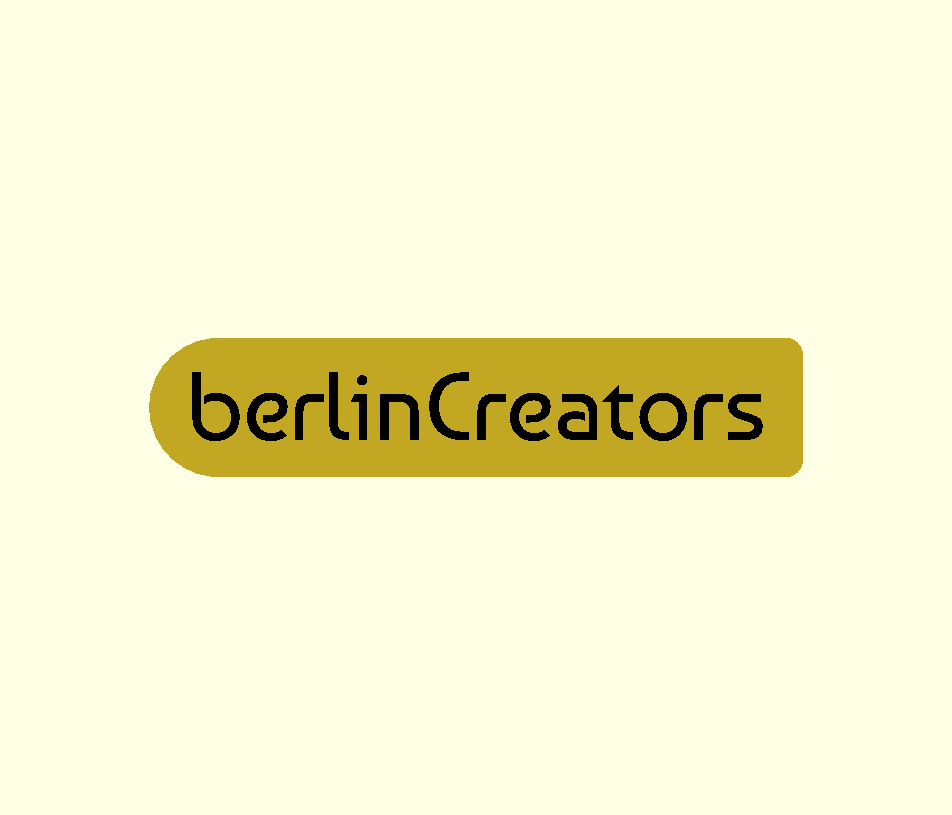

# **OpenSCAD**

Ein OpenSCAD Basis Tutorial von Peter Recktenwald 

https://www.berlincreators.de

---

# Was ist OpenSCAD?

OpenSCAD ist eine freie Software um 3D CAD Objekte zu designen. Im Gegensatz zu vielen anderen CAD Programmen werden in OpenSCAD die 3D Objekte mit einer textbasierten Skriptsprache erstellt.
Die Objekte bestehen aus einfachen Grundkörpern die zu komplexen 3D Modellen kombiniert werden. 

---

# Was wird benötigt?

* OpenSCAD http://openscad.org/downloads.html
* Basis Tutorial https://github.com/robotfreak/badge-creator
* FontAwesome fonts https://github.com/FortAwesome/Font-Awesome
* Baumans font https://www.1001fonts.com/baumans-font.html

---

# Installation

OpenSCAD läuft auf Linux,Mac und Windows Platformen (auch auf dem Raspberry Pi, siehe https://github.com/koendv/openscad-raspberrypi/releases). 

Das Basis Tutorial kann als Zip Datei heruntergeladen werden und in einem beliebigen Ordner ausgepackt werden. 

Die Fonts werden je nach OS entsprechend installiert und stehen dann unter OpenSCAD zur Verfügung.

---

# Los geht's mit dem Customizer 

Anfangen wollen wir mit dem Customizer. Da sich OpenSCADModelle sehr gut parametrisieren lassen ist dies ein einfacher Einstieg in den Umgang, der ohne Programmierkenntnisse auskommt.

Dazu öffnen wir OpenSCAD  und laden das Skript badge-creator.scad aus dem Basis Tutorial Ordner.

Den Editor links im Bild schliessen wir zunächst (klick auf das x). Statt dessen benötigen wir den Customizer. Im Menü 'Windows' den Haken vor 'Hide customizer' entfernen.

---

---

# Navigation in der Vorschau

Die Vorschau des Modells kann mit dem Scrollrad der Maus vergrößert/verkleinert werden.

Bei gedrückter linker Maustaste lässt sich das Modell in den Raumachsen bewegen.

Bei gedrückter rechter Maustaste lässt sich die Kameraposition, der Blick auf das Modell, ändern.

Zudem gibt es eine Iconleiste unter dem Vorschau Fenster, um die Sicht auf das Modell zu ändern. 

---

# Der Customizer

Über den Customizer lassen sich Parameter des Modells ändern, sofern der Schöpfer des Modells dies vorgesehen hat. 

In unserem Beispiel, dem badge-creator können die globalen Parameter u.a Form, Breite und Höhe des Badge, sowie der Text, Postition, Font und Fontgröße für maximal 4 Textzeilen geändert werden. Zudem kann ein beliebieges SVG Logo oder ein QR Code platziert werden.

Damit lassen sich Badges für viele Anwendungszwecke individuell anpassen, ohne auch nur eine Zeile programmieren zu müssen.   

---

# globale Einstellungen

Zu den globalen Einstellungen zählen die Form des Badge, rund, eckig oder ein SVG als Form. Des weiteren:
* Die Abmessungen 
* die Rundung der Ecken (bei der eckigen Form)
* Die Texthöhe 
* Ob der Text in die Höhe ragt oder nach unten (Gravur) 

---

# Text Einstellungen

Jede der 4 Textzeile kann mit einem beliebigen Text versehen werden, zudem kann eingestellt werden:
* der verwendete Font
* die Fontgröße
* die Position auf dem Badge

Als Sonderfall können auch Icons dargestellt werden, z.B aus dem FontAwesome Brand oder Free Font. 

---

# Logo Einstellungen

Das Logo kann ebenso frei positioniert und in der Größe skaliert werden. Das SVG File muss im selben Ordner liegen wie das Skript.

Ein Soderfall ist der QR Code als Logo. Dieser kann online unter https://ridercz.github.io/OpenSCAD-QR/ erzeuigt werden. Die Daten unter qr_data werden per copy & paste an die entsprechende Stelle in der Datei qrcode.scad eingefügt. 

---

# 1. Übung

Als erste Übung erstellt jeder Teilnehmer ein persönliches Badge, z.B. ein Name Badge, einen Schlüsselanhgänger oder ein Chip für Einkaufswagen.

  

